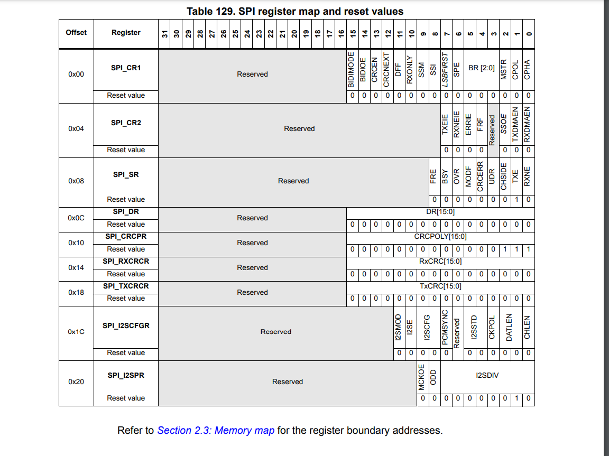

# 8x8 Snake game

- MOSI: Master Out / Slave In data. This pin can be used to transmit data in master
mode and receive data in slave mode.

- Hardware or software slave select management can be set using the SSM bit in the
SPI_CR1 register.
  - Software NSS management (SSM = 1) 
  The slave select information is driven internally by the value of the SSI bit in the
   SPI_CR1 register. The external NSS pin remains free for other application uses.

## Clock phase and clock polarity
Four possible timing relationships may be chosen by software, using the CPOL and CPHA
bits in the SPI_CR1 register. The CPOL (clock polarity) bit controls the steady state value of
the clock when no data is being transferred. This bit affects both master and slave modes. If
CPOL is reset, the SCK pin has a low-level idle state. If CPOL is set, the SCK pin has a
high-level idle state.
If the CPHA (clock phase) bit is set, the second edge on the SCK pin (falling edge if the
CPOL bit is reset, rising edge if the CPOL bit is set) is the MSBit capture strobe. Data are
latched on the occurrence of the second clock transition. If the CPHA bit is reset, the first
edge on the SCK pin (falling edge if CPOL bit is set, rising edge if CPOL bit is reset) is the
MSBit capture strobe. Data are latched on the occurrence of the first clock transition.

## for led matrix we need: `CPOL`: reset (low idle), `CPHA`: Probably reset (rising edge), because matrix reads on rising edge?

Prior to changing the CPOL/CPHA bits the SPI must be disabled by resetting the SPE bit.
Master and slave must be programmed with the same timing mode.
The idle state of SCK must correspond to the polarity selected in the SPI_CR1 register (by
pulling up SCK if CPOL=1 or pulling down SCK if CPOL=0).
The Data Frame Format (8- or 16-bit) is selected through the DFF bit in SPI_CR1 register,
and determines the data length during transmission/reception.

Data can be shifted out either MSB-first or LSB-first depending on the value of the
LSBFIRST bit in the SPI_CR1 register.

Each data frame is 8 or 16 bits long depending on the size of the data programmed using
the DFF bit in the SPI_CR1 register -> 16 

## 28.3.3 Configuring the SPI in master mode
In the master configuration, the serial clock is generated on the SCK pin.
Procedure
!!1. Select the BR[2:0] bits to define the serial clock baud rate (see SPI_CR1 register).
2. Select the CPOL and CPHA bits to define one of the four relationships between the
data transfer and the serial clock (see Figure 248). This step is not required when the
TI mode is selected.
3. Set the DFF bit to define 8- or 16-bit data frame format
4. Configure the LSBFIRST bit in the SPI_CR1 register to define the frame format. This
step is not required when the TI mode is selected.
5. If the NSS pin is required in input mode, in hardware mode, connect the NSS pin to a
high-level signal during the complete byte transmit sequence. In NSS software mode,
set the SSM and SSI bits in the SPI_CR1 register. If the NSS pin is required in output
mode, the SSOE bit only should be set. This step is not required when the TI mode is
selected.
6. Set the FRF bit in SPI_CR2 to select the TI protocol for serial communications.
7. The MSTR and SPE bits must be set (they remain set only if the NSS pin is connected
to a high-level signal).
In this configuration the MOSI pin is a data output and the MISO pin is a data input.

## 28.3.4 Configuring the SPI for half-duplex communication
The SPI is capable of operating in half-duplex mode in 2 configurations.
• 1 clock and 1 bidirectional data wire
• 1 clock and 1 data wire (receive-only or transmit-only)

## 1 clock and 1 unidirectional data wire (BIDIMODE = 0)
In this mode, the application can use the SPI either in transmit-only mode or in receive-only
mode.
• Transmit-only mode is similar to full-duplex mode (BIDIMODE=0, RXONLY=0): the
data are transmitted on the transmit pin (MOSI in master mode or MISO in slave mode)
and the receive pin (MISO in master mode or MOSI in slave mode) can be used as a
general-purpose IO. In this case, the application just needs to ignore the Rx buffer (if
the data register is read, it does not contain the received value).
• In receive-only mode, the application can disable the SPI output function by setting the
RXONLY bit in the SPI_CR1 register. In this case, it frees the transmit IO pin (MOSI in
master mode or MISO in slave mode), so it can be used for other purposes.
To start the communication in receive-only mode, configure and enable the SPI:
• In master mode, the communication starts immediately and stops when the SPE bit is
cleared and the current reception stops. There is no need to read the BSY flag in this
mode. It is always set when an SPI communication is ongoing.
• In slave mode, the SPI continues to receive as long as the NSS is pulled down (or the
SSI bit is cleared in NSS software mode) and the SCK is running

## 6.3.14 RCC APB2 peripheral clock enable register (RCC_APB2ENR) BASE ADDRESS: 0x4002 3800
- Address offset: 0x44

### Bit 12 SPI1EN: SPI1 clock enable
- This bit is set and cleared by software.
  - 0: SPI1 clock disabled
  - 1: SPI1 clock enabled

### Bit 8 ADC1EN: ADC1 clock enable
- This bit is set and cleared by software.
  - 0: ADC1 clock disabled
  - 1: ADC1 clock enabled

I Think the default clock speed will be 16mhz

## SPI1 BASE

0x4001 3000 - 0x4001 33FF SPI1 | Section 28.5.10: SPI register map on page 925

## ADC1 BASE
0x4001 2000 - 0x4001 23FF ADC1 - ADC2 - ADC3 Section 13.13.18: ADC register map on page 430

both on APB2

## GPIO

AFRH 

GPIOA 0x4002 0000 - 0x4002 03FF
MODER 0x00
OTYPER 0x04
AFRL 0x20
AFRH 0x24

## 28.5.10 SPI register map

## DISPLAY 
When  no-decode  is  selected,  data  bits  D7–D0  corre-spond to the segment lines of the MAX7219/MAX7221.Table  6  shows  the  one-to-one  pairing  of  each  data  bitto the appropriate segment line.

https://stackoverflow.com/questions/41133261/led-8x8-matrix-with-max7219-on-arm-stm32-mikroc

## ???
Warning: Since some SPI1 and SPI3/I2S3 pins may be mapped onto
some pins used by the JTAG interface (SPI1_NSS onto JTDI,
SPI3_NSS/I2S3_WS onto JTDI and SPI3_SCK/I2S3_CK onto
JTDO), you may either:
– map SPI/I2S onto other pins
– disable the JTAG and use the SWD interface prior to
configuring the pins listed as SPI I/Os (when debugging the
application) or
– disable both JTAG/SWD interfaces (for standalone
applications).
For more information on the configuration of the JTAG/SWD
interface pins, please refer to Section 8.3.2: I/O pin
multiplexer and mapping.
