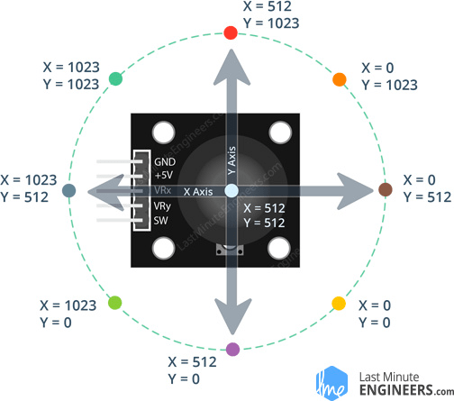

# 8x8 Snake game

## What is it and how does it work?
This is a [snake game](https://en.wikipedia.org/wiki/Snake_(video_game_genre)), implemented 100% in arm assembly on the STM32F407G-DISC1 board.
The game is displayed on an 8x8 LED matrix, and you can control the snake by playstation style joystick.

This project uses:
- [SPI](https://en.wikipedia.org/wiki/Serial_Peripheral_Interface) to send pixel data to an 8x8 LED matrix interfaced with [MAX7219](https://html.alldatasheet.com/html-pdf/73745/MAXIM/MAX7219/126/1/MAX7219.html) display driver.
- [ADC](https://en.wikipedia.org/wiki/Analog-to-digital_converter) to convert joystick position to a digital value.
- [DMA](https://en.wikipedia.org/wiki/Direct_memory_access) to save CPU time by storing ADC data to RAM using the DMA instead of CPU.

# Detailed description of how it works

## Schematic
To make it more clear how our components are connected to the STM32 here is a schematic.

[There will eventually be a schematic here]

## 1. Initializing the IO

The STM32 has many GPIO ports in this project we only use pins from the GPIOA port.
### Pins we use:
- PA1: Joystick Y position input
- PA2: Joystick X position input
- PA4: Chip select for selecting the LED matrix when using SPI
- PA5: Clock signal for the SPI slave (8x8 matrix)
- PA7: MOSI (Master output slave input) pin used for sending data to LED matrix

To use these pins as GPIO-s correctly we have to write an initialization function first.
### In this function we:
- Enable GPIOA clock.
- Select the mode we want for each pin.
  - PA1: Analog mode
  - PA2: Analog mode
  - PA4: General purpose output mode
  - PA5: Alternate function mode
  - PA7: Alternate function mode
- For pins that are configured in alternate function mode:
  - Select alternate function (AF0-15)

The actual implementation of this function is called `init_io` in `src/main.s`.

If you take a look at `init_io` you will notice that at the end we also set a bit in the GPIOA_ODR register. This is to pull PA4 (chip select) high which is necessary for correct SPI communication which will be described in detail later.

More detail about GPIO on this particular chip is available in the [Reference manual](https://www.st.com/resource/en/reference_manual/dm00031020-stm32f405-415-stm32f407-417-stm32f427-437-and-stm32f429-439-advanced-arm-based-32-bit-mcus-stmicroelectronics.pdf) in chapter: `8 General-purpose I/Os (GPIO)`

## 2. Configuring the ADC and DMA
We will use the ADC and DMA to convert and store the joystick position. 
So first we need to configure the ADC
## Configuring the ADC
This procedure is implemented as `init_adc1` and `enable_adc1` in `src/main.s`.

### What we do:
- Enable ADC1 clock (set ADC1EN in RCC_APB2ENR)
- Reset all ADC1 registers.
- Set resolution to 10 bits.
  - We could also just use 8bits because we really don't need accuracy here...
- Enable scan mode (set SCAN in ADC_CR1)
  - Scan mode makes the ADC convert all channels that we specify in ADC_SQR registers in [round robin](https://www.google.com/search?q=round+robin) fashion.
- Set CONT bit, continuous conversion (set CONT in ADC_CR2)
  - Enables continuous conversion, so ADC doesn't stop after we have converted all channels.
- Enable setting EOC flag after each conversion (set EOCS in ADC_CR2)
- Enable DMA and DDS (set DMA and DDS in ADC_CR2)
  - Since we will use DMA to transfer data to memory, we need to tell this to the ADC (set DMA bit).
  - We also set DDS bit so that the ADC keeps issuing DMA requests as long as data are converted and DMA bit is set.
- Set 2 conversions as regular channel sequence length (set L as 0b1 in ADC_SQR1)
- Select order of conversions as -> PA1, PA2. (ADC_SQR3 register)
- Enable the ADC (ADC1) (ADON bit in ADC_CR2)
- Wait 10ms for ADC to stabilize.

Now the ADC is configured, **but not yet started**. This is important, because if we would actually
 start converting data the ADC would fail as an overrun would occur. Overruns occur 
 when the ADC_DR (data register) gets overwritten before it has been read from, hence invalidating the data.

Next of we will configure the DMA.
## Configuring the DMA

The STM32 has two DMA controllers. In this project we are using DMA2, because DMA1 isn't connected to ADC1.
DMA2 however has ADC1 available on Channel0 Stream0 (and also stream4) according to the DMA2 request mapping.

### To initialize DMA2:
- Enable DMA2 clock (set bit 22 in AHB1ENR)
- Reset DMA_S0CR
- Wait for EN bit in DMA_S0CR to reset.
- Reset DMA_LISR and DMA_HISR registers.
- Select Channel 0 Stream 0 (CHSEL bits in DMA_S0CR)
- Select direction peripheral to memory (DIR bits in DMA_S0CR)
- Set peripheral data size and memory data size as half word, because ADC resolution is set to 12 bit. (PSIZE, MSIZE in DMA_S0CR)
- Set priority level as very high (PL bits in DMA_S0CR)
- Enable circular mode (CIRC bit in DMA_S0CR)
- Enable memory increment mode (MINC bit in DMA_S0CR)
- Set 2 as the number of data items to transfer (DMA_S0NDTR register)
- Set stream0 Peripheral address in DMA_S0PAR register. I set this address as `ADC1_BASE + ADC_DR`; So the data register of ADC1
- Set stream0 memory address in DMA_S0MAR as address of `JOYSTICK_POS`
- Enable Stream0, (EN bit in DMA_S0CR)

## Start conversion
After we have both ADC and DMA set up we can actually start converting and storing data.
### To do so we need to:
- Reset ADC1 status register (ADC_SR)
- Start conversion of regular channels on ADC1 (Set SWSTART in ADC_CR2)

## 2. Getting joystick input data

A joystick is essentially just two [potentiometers](https://en.wikipedia.org/wiki/Potentiometer), 
one for the X and one for the Y axis.

By moving the stick you move the potentiometer, thereby adjusting the resistance.
More resistance == less voltage and vice versa.

These voltages are two of five output pins from the joystick module (VRx and VRy).
The other pins are VCC and GND, and lastly the SW pin, which is connected to the switch of the stick (active when you press down).

As mentioned in [section 1](#1.-Initializing-the-IO), we are using pins PA1 (VRy) and PA2 (VRx) as Y and X inputs.

To 

## 3. Communicating with the LED matrix
Configuration of the serial peripheral interface is implemented as `init_spi1` in `src/main.s`.
The STM32 has three serial peripheral interfaces (SPI1, SPI2, SPI3).
As you can probably tell by how I named my init_spi1 function, we are going to use SPI1.

