# Snake game on an 8x8 LED matrix using the STM32F4 discovery board.

In this gist we will be implementing a snake game on bare metal. This means we will only use assembly and registers, without any fancy tools such as the CUBEMX :)

## Parts list

- [STM32F407G-DISC1](https://www.st.com/en/evaluation-tools/stm32f4discovery.html) board
- 8x8 LED MATRIX with [MAX7219](https://html.alldatasheet.com/html-pdf/73745/MAXIM/MAX7219/126/1/MAX7219.html) display driver.
- [Joystick module](https://components101.com/modules/joystick-module)
- [Wires with female to female dupont connectors](https://www.switchelectronics.co.uk/media/catalog/product/cache/6a7c936596f0203147e2e413c59d2826/t/u/tumbnail_6df6683f-b01b-42ea-b1b6-5d25a6c5b0fb.jpg)

## Lets start

As a starting point we are going to take [this](https://github.com/zrezke/8by8snake-template) repository which is basically a modified version of the [stm32f4 assembly template](https://github.com/fcayci/stm32f4-assembly) by [fcayci](https://github.com/fcayci) to get assembly up and running on the stm32.

Clone the repository:

```sh
git clone https://github.com/zrezke/8by8snake-template
cd 8by8snake-template
```

If you now connect your board to your computer and run:

```sh
make && make burn
```

you should see 4 LED-s light up on your device!

If this is not working you might not have tools such as `make` installed on your machine... Take a look at https://github.com/fcayci/stm32f4-assembly#option-2---custom-development-environment and install the necessary tools!

## Communicating with the matrix

We will start by connecting and configuring the LED matrix.
As specified in the parts list we will be using an 8x8 LED MATRIX with [MAX7219](https://html.alldatasheet.com/html-pdf/73745/MAXIM/MAX7219/126/1/MAX7219.html) display driver.  

### Connecting the LED matrix

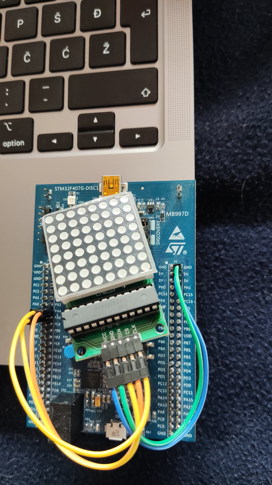

| LED MATRIX | STM32 |
| ---------- | ----- |
| VCC        | 5v    |
| GND        | GND   |
| DIN        | PA7   |
| CS         | PA4   |
| CLK        | PA5   |

## How to send data to the matrix?

The MAX7219 uses SPI to communicate with other devices.

## SPI

[SPI](https://en.wikipedia.org/wiki/Serial_Peripheral_Interface) is a synchronous communication protocol, which uses a clock signal (CLK -> PA5) to synchronize the communication and a Chip Select (CS -> PA4) to `enable` the chip we are communicating with. There are also MOSI (Master out slave in) and MISO (Master in slave out) data pins, in our case is just one pin DIN -> PA7 which we will use as MOSI (Master out slave in).

For our purposes we are going to configure the SPI as a typical master-slave communication where the STM32 will be the master and MAX7219 will be the slave.

## SPI on the STM32

STM32 has three SPIs, we will use SPI1.

We will configure the SPI in **transmit only mode with software slave management,** meaning that we are only going to be writing data to MOSI (Master Out Slave In) pin (PA7 in our case) and driving the chip select (PA4 in our case) through software.

## GPIOA configuration

As you can see in [Connecting the LED matrix](#connecting-the-led-matrix) we are only using **PA** pins which are pins from the GPIO-A port. We will implement a function called **init_io** which will configure GPIOA_CR (GPIOA control register) to specify how we want to use pins 4, 5 and 7.

### GPIOA configuration procedure:

- Enable clock for the GPIO-A port
- Select mode for each pin in **GPIOA_MODER** register.
  - PA4: general purpose output
  - PA5 and PA7: **alternate function** mode.
- For PA5 and PA7 select the right alternate function in the **GPIOA_AFRL** register
  - To find the correct alternate function for each pin look for **Table 9. Alternate function mapping** in the [STM32 datasheet](https://www.st.com/resource/en/datasheet/dm00037051.pdf)

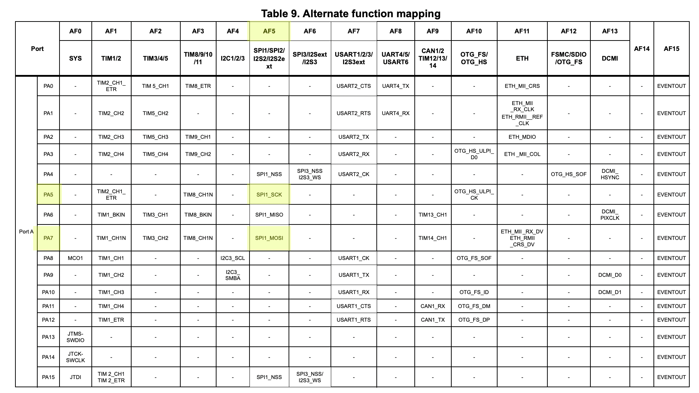

```s
init_io:
  push { r5, r6, lr }

  // Enable GPIOA clock
  ldr r5, =RCC_BASE
  ldr r6, [r5, #RCC_AHB1ENR]
  orr r6, #1
  str r6, [r5, #RCC_AHB1ENR]

  // GPIOA_MODER
  ldr r5, =GPIOA_BASE
  /*
  We will use software slave management and manually set and reset chip select,
   so set pin 4 as general purpose output
   */
  ldr r6, [r5]
  orr r6, #(0b01 << 8)
  // Select alternate function mode (MODER register) on pins 5 (SPI1 SCK) and 7 (SPI1 MOSI)
  orr r6, #(0b10 << 10)
  orr r6, #(0b10 << 14)
  str r6, [r5]

  // Set AF5 (SPI1) for pins 5 and 7
  ldr r6, [r5, #GPIO_AFRL]
  orr r6, r6, #(0b101 << 28)
  orr r6, r6, #(0b101 << 20)
  str r6, [r5, #GPIO_AFRL]

  // Set chip select high
  // We will always pull this pin low before sending data and high after sending data
  ldr r6, [r5, #GPIO_ODR]
  orr r6, #(1<<4)
  str r6, [r5, #GPIO_ODR]

  pop { r5, r6, pc }
```

Add this function somewhere bellow `Default_Handler` and modify your `_start` function so we will call `init_io` when the program starts:  
```s
_start:
  bl init_io
```

We have now configured the GPIO pins for SPI. We still need to actually configure the SPI.

## Configuring the SPI
As I said, we will configure STM32 SPI in master, transmit only mode with software slave management. To configure our SPI in such way we need to configure the SPI_CR1 (control register).  

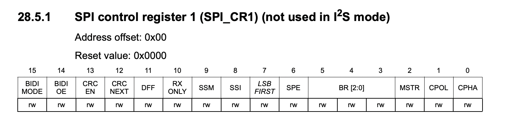

### SPI_CR1 configuration:

- Configure SPI in master mode:
  - Set `MSTR` = 1
- Configure SPI in transmit only mode
  - Set `BIDIOE` = 1.

### We also have to take into account the data format of MAX7219...

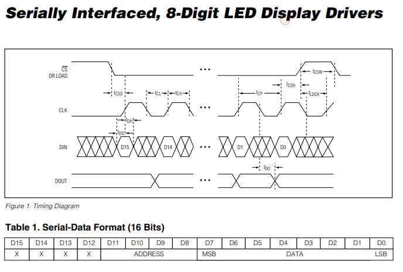  
\# Note: In the documentation the **CS** pin of MAX7219 is referred to as **LOAD**.  
From the [documentation of MAX7219](https://html.alldatasheet.com/html-pdf/73745/MAXIM/MAX7219/126/1/MAX7219.html) we can understand that:

- We need to send 16-bit data packets (MSB sent first), where the 4 MSB bits are **don't care** bits and don't matter but need to be there...
  - Set `DFF` (Data frame format) = 1 (16-bit)
  - `LSBFIRST` (Least significant bit first) = 0
- The data is loaded into a buffer of the MAX7219 chip on each rising edge of the clock.
  - `CPOL` (Clock polarity) = 0, Low idle clock.
  - `CPHA` (Clock phase) = 0, transmit data on rising clock edge.
- The data we sent is loaded from the buffer into control or data (digit) registers on the rising edge of LOAD (CS).
  - As we are using software slave management, we will always manually reset PA4 before transmitting data and set it again after transmission, so we only need to configure:
    - `SSM` (Software slave management) = 1
    - `SSI` (Internal slave select) = 1

After we have written these values to SPI_CR1 we can enable the SPI by setting `SPE` (SPI enable) bit in SPI_CR1.

Let's implement this configuration in a function called `init_spi1`.

```s
init_spi1:
  push { r5, r6, lr }

  // ENABLE Clock
  ldr r5, =RCC_BASE
  ldr r6, [r5, #RCC_APB2ENR]
  // Bit 12: SPI1 clock enable
  orr r6, #(1 << 12)
  str r6, [r5, #RCC_APB2ENR]

  // Reset SPI1_CR
  ldr r5, =SPI1_BASE
  mov r6, 0
  str r6, [r5]

  // Configure SPI_CR1
  mov r6, #0b00 // CPOL,CPHA
  orr r6, #(1<<14) // BIDIOE
  orr r6, #(1<<2) // MSTR
  orr r6, #(0b11<<8) // SSI, SSM
  orr r6, #(1<<11) // DFF
  str r6, [r5]

  // Enable SPI
  ldr r6, [r5]
  orr r6, #(0b1<<6) // SPE
  str r6, [r5]

  pop { r5, r6, pc }
```

Define it bellow `Default_Handler` and append a call to `init_spi1` in `_start`:  
```s
_start:
  bl init_io
  bl init_spi1
```

Great! The SPI should now be configured and ready to send data!

## Sending data with SPI

Let's implement a function called `transmit_spi1` that will transmit data with SPI.  
Our function will receive the data we want to send though register **r0** and transmit it on PA7.

### Transmission procedure:

- Pull Chip Select (PA4) LOW
- Write data from **r0** to **SPI_DR** (SPI data register)
- Wait until **TXE** (Transmit buffer empty) in **SPI_SR** is set high.
- Wait until **BSY** (SPI busy) in **SPI_SR** bit is reset.
- Pull Chip Select (PA4) high
  - MAX7219 loads data into internal registers on rising edge of CS.

```s
transmit_spi1:
  push { r5, r6, lr }
  // Pull chip select low
  ldr r5, =GPIOA_BASE
  ldr r6, [r5, #GPIO_ODR]
  eor r6, #(1<<4)
  str r6, [r5, #GPIO_ODR]

  ldr r5, =SPI1_BASE
  transmit_spi1_loop:
    ldr r6, [r5, #SPI_SR]
    tst r6, #2
    beq transmit_spi1_loop
    // Transmit contents of r0
    str r0, [r5, #SPI_DR]

  // Wait for txe, then for bsy
  wait_txe_spi1:
    ldr r6, [r5, #SPI_SR]
    tst r6, #2
    beq wait_txe_spi1
    wait_bsy_spi1:
      ldr r6, [r5, #SPI_SR]
      tst r6, #128
      bne wait_bsy_spi1

  // Pull chip select high
  ldr r5, =GPIOA_BASE
  ldr r6, [r5, #GPIO_ODR]
  orr r6, #(1<<4)
  str r6, [r5, #GPIO_ODR]
  pop { r5, r6, pc }
```

## Test if the SPI and the display are working

To test if our communication is working let's send a data packet which will put the display into **TEST MODE**. Test mode makes all pixels light up with max brightness.  
In the assembly template I have predefined a constant called `ADDR_DISPLAY_TEST` which is the address of **display test register** of the MAX7219. In this register we can enable or disable test mode. **To enable test mode set LSB of this register to 1.**

Temporarily update `_start` to enable test mode on the display:

```s
_start:
  bl init_io
  bl init_spi1
  ldr r0, =ADDR_DISPLAY_TEST
  add r0, #1
  bl transmit_spi1
```

Run: `make && make burn` and you should now see a fully lit up led matrix.  
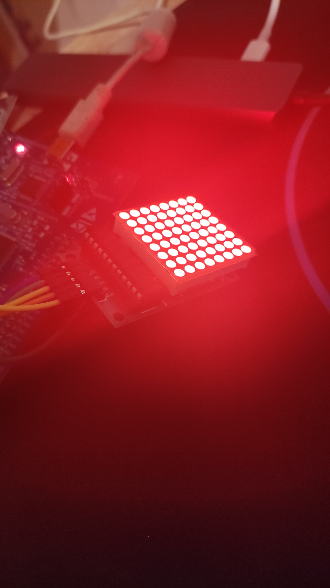

## Setting up the display for sending pixel data

The register addresses of the display are defined in the table bellow:  
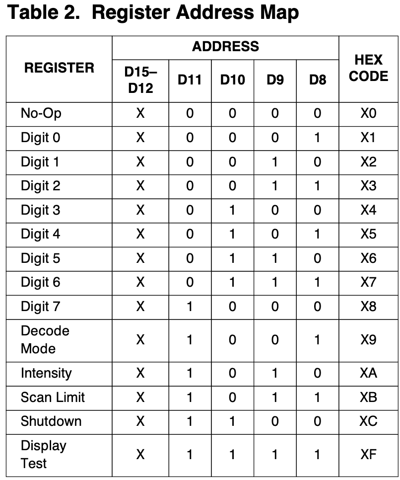  
The digit registers are the ones that interest us the most because they are where you store what you want to draw on the screen. The data in these digit registers can be treated as [BCD](https://en.wikipedia.org/wiki/Binary-coded_decimal), or as column, row data, depending on the mode you set in the Decode register.

For our purpose, which is displaying pixels at exact column, row positions, we are going to use **no decode** mode for all digits.

### Addressing example
To clarify addressing of columns and rows here is an example of a data packet sent to the display:  
  
To light up the display in this way we would have to transmit: **0001 00000001** to the display. The four MSB bits are the address of the data register in this case representing the first column (address of Digit 0 register). The next 8 bits represent 8 rows where LSB is the top row.

## First let's configure the display

There are a 5 registers we need to configure to ensure correct display behavior:

- Shutdown register
  - Set normal operation
- Decode register
  - Set No Decode for all digits
- Intensity register
  - Set to 3/32 intensity (one more than lowest)
- Scan limit register
  - Display all digits (columns)
- Display test
  - Set normal operation

```s
configure_matrix:
  push { r0, lr }
  ldr r0, =ADDR_SHUTDOWN
  add r0, #1
  bl transmit_spi1

  ldr r0, =ADDR_DECODE
  bl transmit_spi1

  ldr r0, =ADDR_INTENSITY
  add r0, #1
  bl transmit_spi1

  ldr r0, =ADDR_SCAN_LIMIT
  add r0, #7
  bl transmit_spi1

  ldr r0, =ADDR_DISPLAY_TEST
  bl transmit_spi1

  bl clear_display
  pop { r0, pc }
```
Add this function somewhere after `Default_Handler` and modify `_start`:  

```s
_start:
  bl init_io
  bl init_spi1
  bl configure_matrix
```

## Sending pixel data to the display

Because it is going to come in handy later, we will always keep an internal representation of what is being drawn on the screen in a **variable** called **PIXEL_DATA**. Make sure you define this variable in the **.bss section** and assign 8 bytes of space to it, or your code **will probably not work**.  
**You can imagine PIXEL_DATA as an array of bytes, where the byte stores information about which rows in the column to light up and the index of the byte is the column index.**

```s
/*
 The .section .bss is already included in the asm template,
  put the PIXEL_DATA definition there!
*/
.section .bss
PIXEL_DATA: .space 8
```

Now to send **PIXEL_DATA** to the display, we are going to write a **render** function that will loop through PIXEL_DATA and send row data for each column:  
```s
render:
  push { r0, r1, r2, r5, lr }
  bl update_pixel_data
  bl clear_display
  /*
  We will use r3 to store the current column address.
  This will be incremented every iteration by 0x100, because this is
  how far apart column registers are and we will add this value to the row data from PIXEL_DATA
  to get a data packet containing column, row data.
  */
  mov r3, #0x100
  // Load address of PIXEL_DATA into r5
  ldr r5, =PIXEL_DATA
  render_loop:
    // Load row data stored at r5 and increment r5 for the next iteration
    ldrb r0, [r5], #1
    // Concatenate column and row data, and transmit it.
    orr r0, r3
    bl transmit_spi1
    // Increment column and check if the end has been reached.
    add r3, #0x100
    cmp r3, #0x900
    bne render_loop
  pop { r0, r1, r2, r5, pc }
```

The render function contains some other functions we haven't defined yet, so lets do it now.

```s
clear_display:
  push { r5, r6, lr }
  ldr r0, =COL0
  clear_display_loop:
    bl transmit_spi1
    add r0, #0x100
    cmp r0, #0x900
    bne clear_display_loop
  pop { r5, r6, pc }

update_pixel_data:
  push { r5, r6, lr }
  ldr r5, =PIXEL_DATA
  // Clear pixel data
  mov r6, #0
  str r6, [r5]
  str r6, [r5, #4]

  // Draw the top pixel in column 0
  mov r6, #1
  strb r6, [r5]
  pop { r5, r6, pc }
```

- `clear_display` clears all column registers
- `update_pixel_data` **currently clears PIXEL_DATA and then sets the top pixel in column 0, the result will look like [the addressing example](#addressing-example). We will modify this function later on to draw the snake.** The pixel data always has to be cleared, because we only want to show the latest updated data which is easiest to do by just clearing and rewriting everything. This will become more clear later when we will have constantly changing data (the snake).  

Now we will temporarily modify `_start` to call render:  
```s
_start:
  bl init_io
  bl init_spi1
  bl configure_matrix
  bl render
```
Later when we have implement a **game loop**, we will move `render` there...

You can now run `make && make burn` and the result should look like this:  
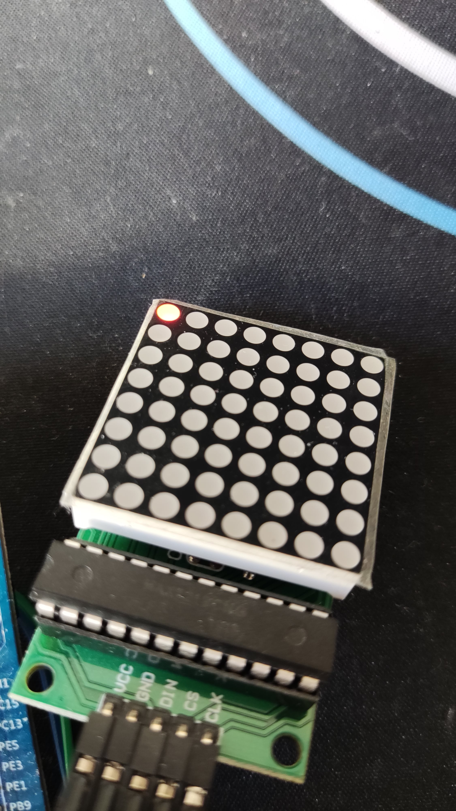  

We now have everything ready to start implementing a snake!  

## Programming the snake

Programming the snake is easier than you might think. You can think of a snake as a list that stores body part positions, where each time the snake moves, the values stored in the list shift by one. So for example the position that was stored at index 0 (snake head) gets shifted to index 1 and so on. Now for actually moving the snake left, right, up or down you only have to move the head one pixel left, right, up or down and the rest of the snake will follow. Super simple!

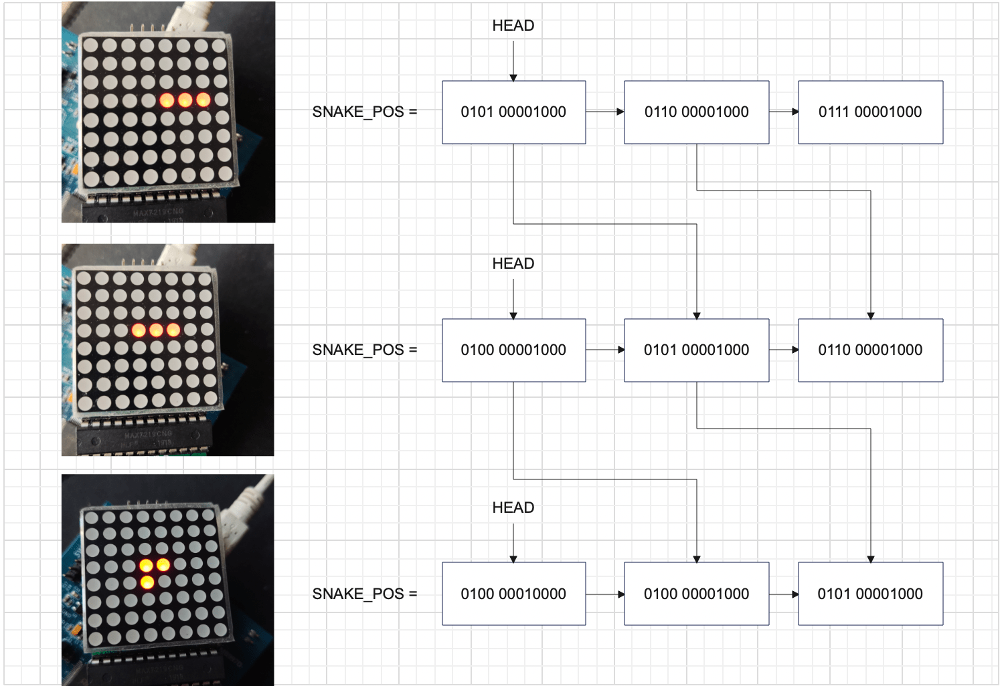  
As you can see in the sketch, we are going to call this list **SNAKE_POS**, we will also need to keep the length of the snake:  **SNAKE_LENGTH** and the direction the snake is heading in: **DIRECTION**.

```s
// Define in bss section
SNAKE_POS: .space 128 //(8x8 x Half Word (we are storing the full data packet))
SNAKE_LENGTH: .space 1
DIRECTION: .space 1
/* SNAKE DIRECTION
0 -> left
1 -> right
2 -> up
3 -> down
*/
```
## Updating snake position

With these variables defined we can start creating a **snake updating function**.  
We will first **check which direction we have to move in and jump into one of move\_{left, right, up, down} functions, where we will create the new head position and store it in r0**. Then **in move_snake, the snake will get shifted in memory**. To do this we will loop from the back, moving the second to last body part to the end of the snake and so on, until we have moved the head position (which is still the old head position, not the new one in r0). **After we have shifted the snake, we override the old head position with the new one from r0**.

```s
update_snake:
  push { r4, r5, r6, lr }
  // Load head position into r0, because move_{left,right...} functions expect it in r0
  ldr r4, =SNAKE_POS
  ldrh r0, [r4]
  // Load direction and jump into the appropriate function
  ldr r5, =DIRECTION
  ldrb r6, [r5]
  cmp r6, #0
  beq move_left
  cmp r6, #1
  beq move_right
  cmp r6, #2
  beq move_up
  cmp r6, #3
  beq move_down

  // Shift the snake in memory
  move_snake:
    // Already have SNAKE_POS address in r4
    ldr r3, =SNAKE_LENGTH
    ldrb r3, [r3]
    // Multiply length by 2 because of HWROD
    add r3, r3, r3
    sub r3, #2
    move_snake_loop:
      ldrh r2, [r4, r3]
      add r3, #2
      strh r2, [r4, r3]
      subs r3, #4
      cmp r3, #-2
      bne move_snake_loop
      strh r0, [r4]

  pop { r4, r5, r6, pc }
```

Now we have to define the move\_{left, right, up, down} functions.  
**I am only going to define left and up here because right and down are very similar**, you can find them in my [repository](https://github.com/zrezke/8by8snake) or implement them yourself.

### Move left
For the move_left, we have to subtract one column (0x100) from the position stored in r0 and then check if we have gone out of the display range. If that happened we want to spawn the head on the right end of the screen in the same row. To do so, add 0x800 to r0. This translates to column7 (last column) + whatever row that is stored in r0.

```s
move_left:
  sub r0, 0x100
  cmp r0, #0x100
  it lt
  addlt r0, #0x800
  b move_snake
```

### Move up

Moving up is a little more complicated, because we have to shift the row bits while preserving the column information.  
To shift the rows without changing columns we are going to extract the row bits from r0 by **and-ing** it with 0xFF and storing the result in r1. From there we can simply right shift r1 by one bit and we have essentially just moved one row up. Now we have to stitch together the new row data and the old column data. In r0 we still have the (old) full position. We will **and** r0 with 0xF00, which will only keep the column info in r0. After this we just merge r0 and r1 together by **or-ing** them and thats it!

```s
move_up:
  and r1, r0, #0xFF
  mov r1, r1, lsr 1
  cmp r1, #0
  it eq
  moveq r1, #128
  and r0, #0xF00
  orr r0, r1
  b move_snake
```

## The game loop

We now basically have all the functions to make a moving snake. However we are yet to develop a game loop.  
A game loop is pretty simple, it's a never ending loop that updates and renders the game.

### We can write a simple game loop like this:

```s
/*
Define this after _start but before Default_Handler,
so the game_loop will start executing instead of Default_Handler,
after _start.
*/
game_loop:
  bl update_snake
  bl render
  b game_loop
```

Now **remove** `bl render` from `_start`:  
```s
_start:
  bl init_io
  bl init_spi1
  bl configure_matrix
```


In our case we have to slow the loop down because, if we leave it like this the game will update like 16 million times a second and the snake will move with supersonic speed.  
**For this slow down we are going to use the Systick timer**, a timer that is part of Cortex-M4 itself (not an STM32 peripheral).

## Systick timer configuration

As with any other peripheral we have to write a configuration function.  
We will configure the timer, so that it triggers an interrupt every 200ms.  
To do this the timer needs to be configured in **counter mode** with **interrupt enabled** and a **reload value** of 3199999 which takes 200ms to count down to zero from.  
For more detail look at:  
- [Systick documentation](https://developer.arm.com/documentation/dui0552/a/cortex-m3-peripherals/system-timer--systick?lang=en). I couldn't find it for Cortex M4, but it is the same.

```s
init_tc:
  push {r5, r6, lr}
	ldr r6, =SCS

	ldr r5, =SYSTICK_RELOAD_200MS
	str r5, [r6, #SCS_SYST_RVR]

  // Reset value
	mov r5, #0
	str r5, [r6, #SCS_SYST_CVR]

  // Enable counter
	orr r5, #1
  // Enable interrupt
  orr r5, #2
  // Processor clock as clock source
  orr r5, #4
	str r5, [r6, #SCS_SYST_CSR]

  pop {r5, r6, pc}
```

Now append init_tc to `_start`:  
```s
_start:
  bl init_io
  bl init_spi1
  bl configure_matrix
  bl init_tc
```


Since the systick timer will generate an interrupt, we need a function that will **handle this interrupt**. 
### Interrupt handler:

```s
.global SysTick_Handler
.type SysTick_Handler, %function

SysTick_Handler:
  push { r5, r6, lr }
  // Reset UPDATED
  ldr r5, =UPDATED
  mov r6, #0
  strb r6, [r5]
  pop { r5, r6, pc }
```

As you can see there is a new variable called **UPDATED**. You can think of **UPDATED** as a boolean, telling our program if the game has already been updated.  
If the game has been updated we will not update it again until the Systick rolls over (end of 200ms) and resets **UPDATED** in the interrupt handler.  
**Let's add this functionality to the game loop:**

```s
game_loop:
  // Check if already updated
  // If updated jump back to game_loop (loop continuously)
  ldr r0, =UPDATED
  ldrb r0, [r0]
  cmp r0, #1
  beq game_loop

  // If game hasn't been updated yet: update it and set UPDATED = 1
  bl update_snake
  bl render
  ldr r1, =UPDATED
  mov r0, #1
  strb r0, [r1]
  b game_loop
```

### **UPDATED** definition:

```s
// bss section
UPDATED:  .space 1
```

## Initializing a snake

Let's populate SNAKE_POS with some initial body parts.  
At the start we are always going to spawn a snake of length 3 with its head at column 4, row 3, facing in the left direction.

```s
init_snake:
  push { r5, r6, lr }
  // Init length
  ldr r5, =SNAKE_LENGTH
  mov r6, #3
  strb r6, [r5]

  // Init direction
  ldr r5, =DIRECTION
  mov r6, #0
  strb r6, [r5]

  // Place body parts
  ldr r6, =SNAKE_POS
  ldr r5, =COL5+8
  strh r5, [r6], #2
  add r5, #0x100
  strh r5, [r6], #2
  add r5, #0x100
  strh r5, [r6]

  pop { r5, r6, pc }
```

Append init_snake to `_start`:  
```s
_start:
  bl init_io
  bl init_spi1
  bl configure_matrix

  bl init_snake
```

This code should work, unfortunately we currently don't have a function to render SNAKE_POS to the display. You might be thinking why not just loop through SNAKE_POS and send every body part to the display? The problem with that is; think about what happens when, say two body parts are in the same column; for example when moving vertically... We will send a data packet for the first body part and then for the second. When we send the second body part we will be overwriting (resetting) the previous body part's row essentially just rendering one pixel every time.

## Rendering the snake

This is where our PIXEL_DATA will come in handy. **We are going to assemble the SNAKE_POS into PIXEL_DATA we can send to the screen.**

### Let's update our update_pixel_data function

We are going to loop through SNAKE_POS and find out which column the body part is in, then join the row of the body part with existing row data for that column in PIXEL_DATA.

```s
update_pixel_data:
  push { r0, r1, r2, r3, r4, r5, r6, lr }
  ldr r5, =PIXEL_DATA
  // Clear pixel data
  mov r6, #0
  str r6, [r5]
  str r6, [r5, #4]

  // Draw snake
  ldr r4, =SNAKE_LENGTH
  ldrb r4, [r4]
  add r4, r4, r4
  ldr r3, =SNAKE_POS
  add r4, r4, r3
  update_snake_pixels_loop:
    // Load one snake pixel
    ldrh r2, [r3], #2
    // Find out column of pixel
    mov r1, r2, lsr #8
    sub r1, #1
    // Extract row data from snake pixel
    and r2, 0xff
    // Orr row data with pixels that are already in same column
    ldrb r0, [r5, r1]
    orr r0, r2
    // Store, loop again till you reach the end of the snake
    strb r0, [r5, r1]
    cmp r3, r4
    bne update_snake_pixels_loop

  // TODO: Draw food
  pop { r0, r1, r2, r3, r4, r5, r6, pc }
```

Now run `make && make burn`. If everything went to plan you should see a snake appear and start moving left.

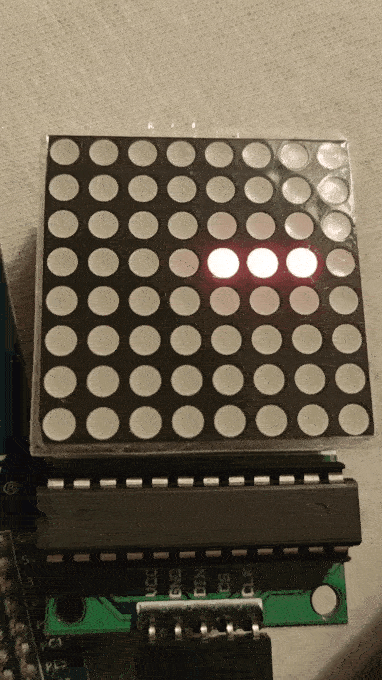


## Changing the direction

We now have something that looks and moves like a snake, but only in one direction.  
We don't actually have any way of changing the direction yet.

As was mentioned in the intro, we will be using a joystick module to control the snake.

## The joystick

The joystick is essentially just two [potentiometers](https://en.wikipedia.org/wiki/Potentiometer),
one for the X and one for the Y axis.

By moving the stick you move the potentiometer, thereby adjusting the resistance.
More resistance = less voltage and vice versa. These voltages can be read on VRx and VRy pins of the joystick.


## Getting joystick input

Joystick VRx and VRy are meant to be used as analog inputs which give us a voltage on the range of [0V - 5V]. To represent analog values in a computer, we have to convert them to digital representations. For this purpose the STM32 has (two) **Analog to Digital Converters** ([ADC](https://en.wikipedia.org/wiki/Analog-to-digital_converter)).

We are going to be using ADC2 with a resolution of 10-bits, giving us a range of [0 - 1024].  
Also I will be using my joystick in the position shown in the photo bellow, so my left, right, up and down won't confuse you.

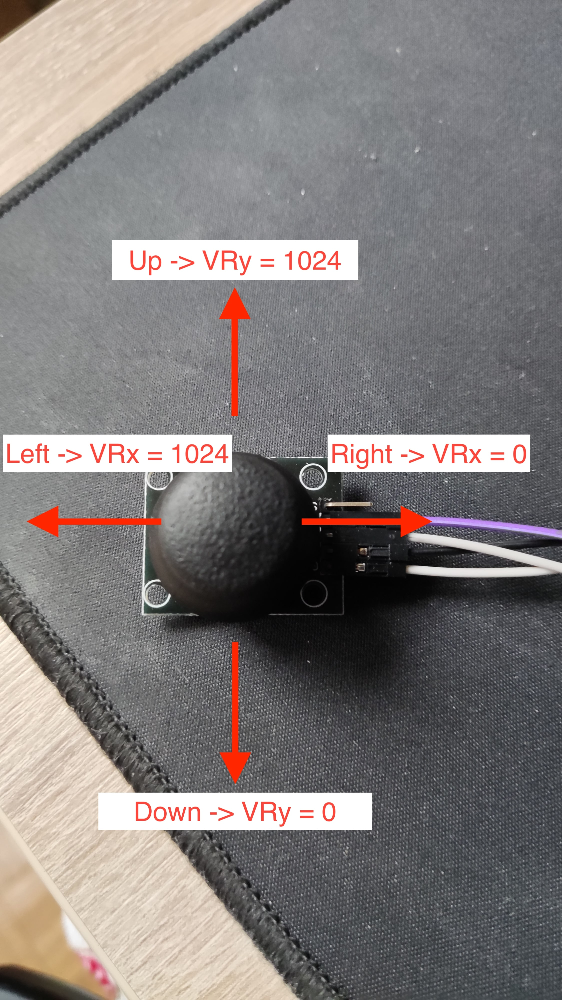  
We will store converted VRx and VRy in a variable called **JOYSTICK_POS**
### Define JOYSTICK_POS:
```s
// .bss section
.align
JOYSTICK_POS: .space 4
```
JOYSTICK_POS has 4 bytes. As we are using 10bit AD conversion and we have two inputs to convert, we need at least 10bits for each input to be stored, so we will be using the first 2 bytes to store VRx and the second two bytes to store VRy.

## Connections

I will be using pins PA1 and PA2 for VRx and VRy respectively.  
You can choose any of the pins that are connected to ADC2. To find eligible pins look for `Table 7. STM32F40xxx pin and ball definitions` in the [datasheet](https://www.st.com/resource/en/datasheet/dm00037051.pdf).  
As you can see PA1 and PA2 both have ADC123_IN listed as additional functions.  
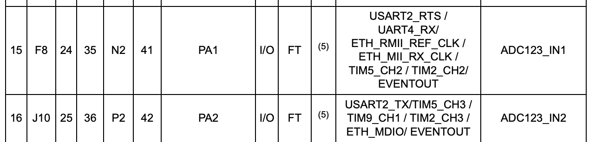

Now to actually use these pins as analog inputs we have to configure them as such.  
Let's update out init_io function to configure PA1 and PA2 as analog gpio.

```s
init_io:
...
// Merge the following lines with what is already in init_io
// GPIOA_MODER
ldr r5, =GPIOA_BASE
// set pins 1,2 as analog
ldr r6, [r5]
orr r6, #(0b11 << 2)
orr r6, #(0b11 << 4)
...
```

## ADC with DMA

With our inputs now configured we can start configuring the ADC. The ADC requires us to read the converted value in it's data register before the next one gets converted, **if we fail to do that the conversion will stop**. We could configure an ADC interrupt and store the data using assembly each time the interrupt gets generated, but in our case this will eat up practically all of our CPU time, since we wil continuously convert joystick input. As the title suggests we will use our ADC in combination with a **Direct Memory Access controller** ([DMA](https://en.wikipedia.org/wiki/Direct_memory_access)),
which allows us to offload the task of reading and storing ADC data from the CPU to the DMA.

## ADC configuration

We are going to be **continuously** converting two ADC channels, PA1 on channel 1 and PA2 on channel 2. We will be using **SCAN mode**, to convert our channels in sequence one after another.

## Initializing ADC1:

- Enable ADC1 clock (set ADC1EN in RCC_APB2ENR)
- Set resolution to 10 bits.
- Enable scan mode (set SCAN in ADC_CR1)
  - Scan mode makes the ADC convert all channels that we specify in ADC_SQR registers in [round robin](https://www.google.com/search?q=round+robin) fashion.
- Set CONT bit, continuous conversion (set CONT in ADC_CR2)
  - Enables continuous conversion, so ADC doesn't stop after we have converted all channels.
- Enable setting EOC flag after each conversion (set EOCS in ADC_CR2)
- Enable DMA and DDS (set DMA and DDS in ADC_CR2)
  - Since we will use DMA to transfer data to memory, we need to tell this to the ADC (set DMA bit).
  - We also set DDS bit so that the ADC keeps issuing DMA requests as long as data are converted and DMA bit is set.
- Set 2 conversions as regular channel sequence length (set L as 0b1 in ADC_SQR1)
- Select order of conversions as -> PA1, PA2. (ADC_SQR3 register)
- Enable the ADC (ADC1) (ADON bit in ADC_CR2)

```s
init_adc1:
  push { r5, r6, lr }
  // Enable ADC1 clock
  ldr r5, =RCC_BASE
  ldr r6, [r5, #RCC_APB2ENR]
  orr r6, #(1<<8)
  str r6, [r5, #RCC_APB2ENR]

  ldr r5, =ADC1_BASE
  mov r6, #0
  // CR1 settings
  // Set RES to 10bits
  mov r6, #(0b01<<24)

  // SCAN MODE
  orr r6, #(1<<8)

  // EOCIE
  // orr r6, #(1<<5)
  str r6, [r5, #ADC_CR1]

  //CR2 settings
  // set CONT mode
  mov r6, #0b10
  // EOC after each conversion
  orr r6, #(1<<10)
  // Enable DMA, DDS
  orr r6, #(0b11<<8)
  str r6, [r5, #ADC_CR2]

  // Two conversions
  mov r6, #(1<<20)
  str r6, [r5, #ADC_SQR1]

  // Select order, PA1, PA2
  mov r6, #1
  orr r6, #(2 << 5)
  str r6, [r5, #ADC_SQR3]

  // SAMPLE TIME
  mov r6, #9
  str r6, [r5, #ADC_SMPR2]

  // Enable ADC1
  ldr r6, [r5, #ADC_CR2]
  orr r6, #1
  str r6, [r5, #ADC_CR2]

  pop { r5, r6, pc }
```
Add init_adc1 to `_start`:  
```s
_start:
  bl init_io
  bl init_spi1
  bl configure_matrix
  bl init_tc
  bl init_adc1

  bl init_snake
```

Our ADC1 is now configured, but not yet started. We **will not start** our ADC1 until we have the DMA ready, to prevent **overrun** errors.

## Configuring the DMA

We will be using DMA2 as this is the DMA controller connected to ADC1.  
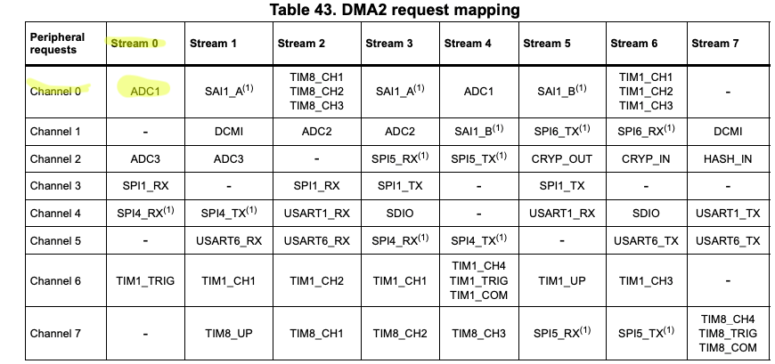

## Configuration:

- Enable DMA2 clock
- Reset DMA_S0CR
- Wait for EN bit in DMA_S0CR to reset.
- Reset DMA_LISR and DMA_HISR registers.
- Select Channel 0 (CHSEL bits in DMA_S0CR)
- Select direction peripheral to memory (DIR bits in DMA_S0CR)
- Set peripheral data size and memory data size as half word, because ADC resolution is set to 10 bit. (PSIZE, MSIZE in DMA_S0CR)
- Set priority level as very high (PL bits in DMA_S0CR)
- Enable circular mode (CIRC bit in DMA_S0CR)
  - Reload number of items to be transferred (DMA_S0NDTR) each time the value reaches 0.
- Enable memory increment mode (MINC bit in DMA_S0CR)
  - Will increment memory location pointer by half word each time a transfers happens.
    - This will enable us to write VRx position to first half word of JOYSTICK_POS and VRy to the second one...
- Set 2 as the number of data items to transfer (DMA_S0NDTR register)
- Set Stream0 peripheral address in DMA_S0PAR register as: `ADC1_BASE + ADC_DR` (data register of ADC1)
- Set Stream0 memory address in DMA_S0MAR as address of `JOYSTICK_POS`
- Enable Stream0, (EN bit in DMA_S0CR)

```s
init_dma2:
  push { r5, r6, lr }
  // Enable DMA2 clock
  ldr r5, =RCC_BASE
  ldr r6, [r5, #RCC_AHB1ENR]
  orr r6, #(1<<22)
  str r6, [r5, #RCC_AHB1ENR]

  ldr r5, =DMA2_BASE
  mov r6, #0
  str r6, [r5, #DMA_S0CR]
  wait_dma2_s0_reset:
    ldr r6, [r5, #DMA_S0CR]
    tst r6, #1
    bne wait_dma2_s0_reset

  mov r6, #0
  str r6, [r5, #DMA_LISR]
  str r6, [r5, #DMA_HISR]

  // CHSEL: 0, DIR: Peripheral to memmory,
  mov r6, #0

  // PSIZE, MSIZE hword
  orr r6, #(0b01<<11)
  orr r6, #(0b01<<13)

  // Priority very high
  orr r6, #(0b11 << 16)

  // CIRC MODE ENABLE
  orr r6, #(1<<8)

  // TCIE = 1
  orr r6, #(1<<4)

  // MEMORY INC
  orr r6, #(1<<10)
  str r6, [r5, #DMA_S0CR]

  // N of data items to transfer: 2
  mov r6, #2
  str r6, [r5, #DMA_S0_NDTR]

  ldr r5, =DMA2_BASE
  ldr r6, =ADC1_BASE + ADC_DR
  str r6, [r5, #DMA_S0PAR]

  ldr r6, =JOYSTICK_POS
  str r6, [r5, #DMA_S0M0AR]

  // Enable stream
  ldr r6, [r5, #DMA_S0CR]
  orr r6, #1
  str r6, [r5, #DMA_S0CR]
  pop { r5, r6, pc }
```

Add init_dma2 to `_start`:  
```s
_start:
  bl init_io
  bl init_spi1
  bl configure_matrix
  bl init_tc
  bl init_adc1
  bl init_dma2

  bl init_snake
```

### Starting the ADC

Now that our ADC and DMA are configured we can start the ADC.

```s
start_adc1:
  push { r5, r6, lr }
  ldr r5, =ADC1_BASE
  // Reset status register
  mov r6, #0
  str r6, [r5, #ADC_SR]
  // START
  ldr r6, [r5, #ADC_CR2]
  orr r6, #(1<<30)
  str r6, [r5, #ADC_CR2]
```

Start adc1 in `_start`:  
```s
_start:
  bl init_io
  bl init_spi1
  bl configure_matrix
  bl init_tc
  bl init_adc1
  bl init_dma2
  bl start_adc1

  bl init_snake
```

## Direction changes

We can now start writing out a function that will update our **DIRECTION** variable.  
To update **DIRECTION** we will call our **update_direction** function once for each game loop iteration.  
The function will check the current direction, then if we are currently moving horizontally we only have to check the vertical axis (`check_y`), else if we are moving vertically we only check the horizontal axis (`check_x`), to see if the joystick is in a position we consider a direction change (look at the table bellow).

### check_x:  
|DIRECTION|VRx|
|--|--|
|No change|200 <= VRx <= 800|
|LEFT| VRx > 800|
|RIGHT| VRx < 200|

### check_y:  
|DIRECTION|VRy|
|--|--|
|No change|200 <= VRy <= 800|
|UP| VRy > 800|
|DOWN| VRy < 200|

```s
update_direction:
  push { r2, r3, r4, r5, r6, lr }
  ldr r6, =JOYSTICK_POS

  ldr r3, =DIRECTION
  ldrb r2, [r3]
  cmp r2, #2
  blt check_y
  bge check_x

  check_x:
    ldrh r5, [r6]
    cmp r5, #800 // Joystick is pointing left
    itt gt
    movgt r2, #0
    strbgt r2, [r3]

    cmp r5, #200 // Joystick is pointing right
    itt lt
    movlt r2, #1
    strblt r2, [r3]
    b exit_update_direction

  check_y:
    ldrh r5, [r6, #2]
    cmp r5, #800 // Joystick is pointing up
    itt gt
    movgt r2, #2
    strbgt r2, [r3]

    cmp r5, #200 // Joystick is pointing down
    itt lt
    movlt r2, #3
    strblt r2, [r3]

  exit_update_direction:
  pop { r2, r3, r4, r5, r6, pc }
```

Now update `game_loop`:  
```s
game_loop:
  // Check if already updated in ongoing game loop and wait until next loop begins
  ldr r0, =UPDATED
  ldrb r0, [r0]
  cmp r0, #1
  beq game_loop

  bl update_direction
  bl update_snake
  bl render
  ldr r1, =UPDATED
  mov r0, #1
  strb r0, [r1]
  b game_loop
```

If everything went OK you should now be able to use the joystick to control the snake like this:  


## Food

Let's add food to the game.  
Food will be represented as one pixel, that will light on. To store the position of the food we will create a new variable called **FOOD_POS**.  

```s
// .bss section
FOOD_POS: .space 2
```
We will need to create a function that will spawn the food in a **random** location and a function to eat the food and make our snake bigger.  

## Generating a random food position

We will need to generate two random numbers, one for the column and one for the row index.  
To generate random numbers we can use the hardware **Random Number Generator** ([RNG](https://en.wikipedia.org/wiki/Hardware_random_number_generator)) of the STM32.  

### Initializing RNG
The RNG requires a bit of a special clock configuration. We need to configure the [PLL](https://en.wikipedia.org/wiki/Phase-locked_loop) so that the second PLL output clock, which is connected to the RNG is **48Mhz or lower**.  
We can configure this in the **RCC_PLLCFGR** register.  
Using the following formulas you can configure `PLLQ`, `PLLN`, `PLLM` in **RCC_PLLCFGR** register, so that **f(RNG clock output) = 48Mhz**.
- PLL clock input = 16Mhz (by default (HSI clock))
- 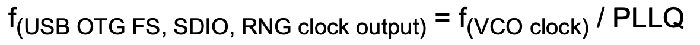
- 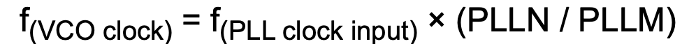

After the **RCC_PLLCFGR** is configured, enable the RNG clock in **RCC_AHB2ENR** and enable the PLL in **RCC_CR**.  

Then after we have the clock configured we follow the steps from the **24.3.1 Operation** section of the [STM32 Reference manual](https://www.st.com/resource/en/reference_manual/dm00031020-stm32f405-415-stm32f407-417-stm32f427-437-and-stm32f429-439-advanced-arm-based-32-bit-mcus-stmicroelectronics.pdf#page=768) to configure the RNG.  

```s
init_rng:
  push { r5, r6, lr }
  ldr r5, =RCC_BASE
  // PLL config RNG_OUT = ((PLL_IN -> 16mhz) * (PLLN/PLLM)) / PLLQ = 48mhz
  // set PLLM as 2 
  mov r6, #2
  // Set PLLN as 12
  orr r6, #(12<<6)
  // Set PLLQ as 2
  orr r6, #(2<<24)
  str r6, [r5, #RCC_PLLCFGR]

  // Enable RNG clock
  ldr r6, [r5, #RCC_AHB2ENR]
  orr r6, #(1<<6)
  str r6, [r5, #RCC_AHB2ENR]

  // Enable PLL
  ldr r6, [r5, #RCC_CR]
  orr r6, #(1<<24)
  str r6, [r5, #RCC_CR]

  ldr r5, =RNG_BASE
  // Turn off rgn, reset SR
  mov r6, #0
  str r6, [r5, #RNG_CR]
  str r6, [r5, #RNG_SR]
  // Start RNG
  mov r6, #4
  str r6, [r5, #RNG_CR]

  // Wait for first number and read it
  wait_first_rng:
    ldr r6, [r5, #RNG_SR]
    tst r6, #1
    beq wait_first_rng
  ldr r6, [r5, #RNG_DR]
  pop { r5, r6, pc }
```

Add init_rng to `_start`:  
```s
_start:
  bl init_io
  bl init_spi1
  bl configure_matrix
  bl init_tc
  bl init_adc1
  bl init_dma2
  bl start_adc1

  bl init_snake
  bl init_rng
```

### Placing the food
To place the food we will generate two random numbers and treat them as column, row indexes. When we have the two numbers generated we need to check whether the food position that was generated lies in the snake. If it is inside the snake we will keep generating new positions until we generate one that is not inside the snake. When we have a valid food position we store it in **FOOD_POS**.

```s
place_food:
  push { r1, r2, r3, r4, r5, r6, lr }
  generate_food_position:
    // Generate column
    bl fetch_random_number
    // The RNG gives us a 32bit random number we only want a 3bit number
    // Get 3 MS-bits
    mov r2, r1, lsr 29
    // Add one because columns start from 0x100
    add r2, #1
    // Shift to column position
    mov r2, r2, lsl 8
    // Generate row
    bl fetch_random_number
    // The RNG gives us a 32bit random number we only want a 3bit number
    // Get 3 MS-bits
    mov r3, r1, lsr 29
    mov r4, #1
    lsl r4, r3
    // Create position in r2
    orr r2, r2, r4
    b check_food_in_snake

  // Store the new position in FOOD_POS
  spawn_food:
    ldr r5, =FOOD_POS
    strh r2, [r5]
  pop { r1, r2, r3, r4, r5, r6, pc }

// Pass in food position through r2
check_food_in_snake:
  ldr r5, =SNAKE_POS
  ldr r4, =SNAKE_LENGTH
  ldrb r4, [r4]

  check_food_in_snake_loop:
    ldrh r3, [r5], #2
    cmp r3, r2
    beq generate_food_position
    sub r4, #1
    cmp r4, #0
    bne check_food_in_snake_loop
    b spawn_food

// returns random number in r1
fetch_random_number:
  push {r5, r6, lr}
  ldr r5, =RNG_BASE
  check_rng_ready:
    ldr r6, [r5, #RNG_SR]
    tst r6, #1
    beq check_rng_ready
  ldr r1, [r5, #RNG_DR]
  pop {r5, r6, pc}
```

Now we will place an initial food in `_start`:  
```s
_start:
  bl init_io
  bl init_spi1
  bl configure_matrix
  bl init_tc
  bl init_adc1
  bl init_dma2
  bl start_adc1

  bl init_snake
  bl init_rng
  bl place_food
```

If you now run this no food will show up because we never add FOOD_POS to PIXEL_DATA.

### Change update_pixel_data:
At the end of `update_pixel_data` there is a comment: **TODO: Draw food**. We will **overwrite** our comment with the following code:  
```s
update_pixel_data:
  ...
  // TODO: Draw food
  /*
  Because we will use the existing update_snake_pixels_loop to merge
   FOOD_POS and PIXEL_DATA, we check if we have already been in this part of the code 
   (Store 1 into r6 the first time we are here. The next time there will be 1 in r6 
   and we can jump to end_update_pixel_data).
  */
  cmp r6, #1
  beq end_update_pixel_data
  mov r6, #1
  // TODO: Draw food
  ldr r3, =FOOD_POS
  /*
   Store address of FOOD_POS + 2 into r4 to exit update_snake_pixels
    after one iteration. (r3 and r4 get compared in exit_snake_pixels)
  */
  mov r4, r3
  add r4, #2
  // Use existing function to merge FOOD_POS and PIXEL_DATA
  b update_snake_pixels_loop
  end_update_pixel_data:
  ...
```
Run `make && make burn` you should see a food pixel light up in a random position.  

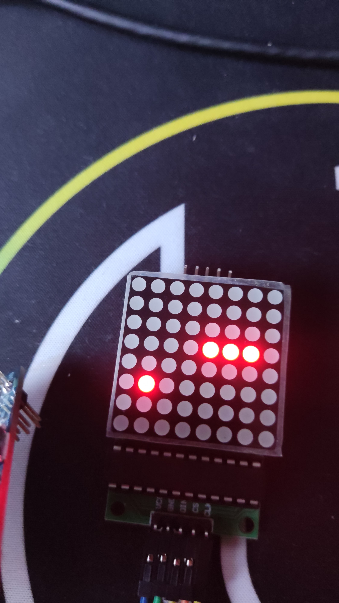

### Eating food
Eating food means finding out if the head position == the food position. If this is true, we only need to increment SNAKE_LENGTH and then call place_food, to place a new food!  

We will check if our head is at food position in the `move_snake` function we wrote before. If you remember, this is the function that shifts the snake in memory. So if we increment SNAKE_LENGTH before we start shifting the snake in memory, we will shift the snake by one more place, thereby making it longer.   

Update move_snake to check if head is at FOOD_POS:  

```s
  move_snake:
    ldr r1, =FOOD_POS
    ldrh r1, [r1]
    cmp r0, r1
    it eq
    bleq eat_food
    // The rest stays the same
    ...
```

Define eat_food:  

```s
eat_food:
  push { r5, r6, lr }
  ldr r5, =SNAKE_LENGTH
  ldrb r6, [r5]
  add r6, #1
  strb r6, [r5]
  bl place_food
  pop { r5, r6, pc }
```

Run `make && make burn`, you should now be able to eat some food!  


## Death
Now our snake can eat, but as you get bigger and the game becomes harder you will notice our snake cannot collide with itself to end the game.  We will implement colliding, so that after we collide, the game restarts automatically.  

### Detecting a collision
Anytime a collision occurs, it is going to be between the head and some other body part, so we need to compare the head position to every body part. We will implement this checking and subsequent game resetting in the `move_snake_loop` (the loop for shifting the snake in memory), as this will loop through the snake anyways, we can use this to avoid a separate loop.  

Update your `move_snake_loop` to this:  
```s
move_snake_loop:
  ldrh r2, [r4, r3]
  // Reset the game if the new head pos is in it's body
  cmp r2, r0
  beq reset_game
  add r3, #2
  strh r2, [r4, r3]
  subs r3, #4
  cmp r3, #-2
  bne move_snake_loop
  strh r0, [r4]
```

```s
reset_game:
  // Reinitialize snake to 3 pixels
  bl init_snake
  // Replace food, in case it was placed where the snake is after init_snake
  bl place_food
  // Continue game
  b game_loop  
```

As always run `make && make burn` and if you collide with yourself you will be reincarnated!  
